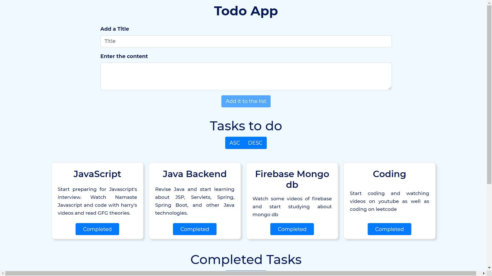

<h1 align="center"> A Todo App built using Fireabase🔥 </h1> 

Link to access the Website <a href="https://todo-app-firebase11.web.app">https://todo-app-firebase11.web.app</a>

 
   <a href="https://todo-app-firebase11.web.app" target="_blank">
    </img>
  </a>

                                         
# Key Points 📋
- This web app comes with various features. It is mainly built with `React`, `SASS`, and `Firestore` from `Firebase` for database.
- Add a Title and it's content in the input boxes. It will be added to the tasks to do section. This will make a `todos` collection in firestore, and the corresponding tasks details such as `id` `title` `content` and `timestamp` will be added to the firestore.
- When the task is complete, Click on the `Completed` button. Now two actions will occur. 
  - A new collection `completed` will be created in the firestore, if not present already, and the completed task will be added in this collection.
  - Now that particular task will be deleted from the `todos` collection in the firestore, as it has been completed now. 
- You can also sort the task, ascending or descending, with respect to the timestamp present in the data that was added to the collection previously. Choose `asc` or `desc` and the cards will be sorted accordingly.
- All the data are being fetched or added in real time by the firestore.
- Deployement has also been done by `Firebase`.

# Technologies and Tools used 🛠️

- [React](https://reactjs.org/)
- [sass](https://sass-lang.com/)
- [Bootstrap](https://getbootstrap.com/)
- [Firebase](https://firebase.google.com/)

# Contributing 💡

If you want to contribute to this project and add new different features in it or make the project more clean and better. Please don't hesitate to open an [pull request](https://github.com/ayushazuri/Portfolio-Website/pulls) or [issue](https://github.com/ayushazuri/Portfolio-Website/issues).

# License 📄

This project is licensed under the MIT License - see the [LICENSE](./LICENSE) file for details.
